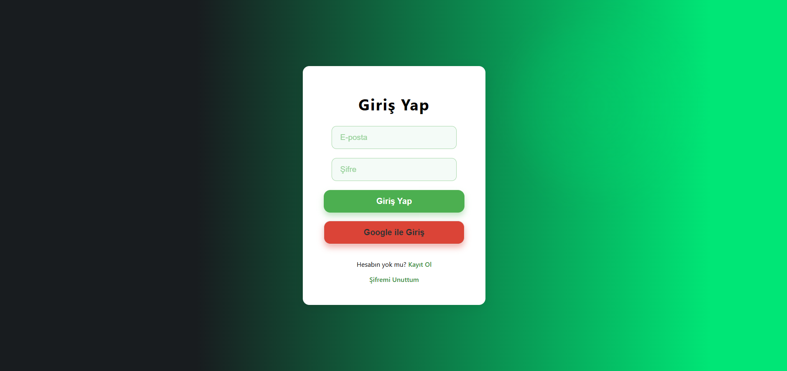
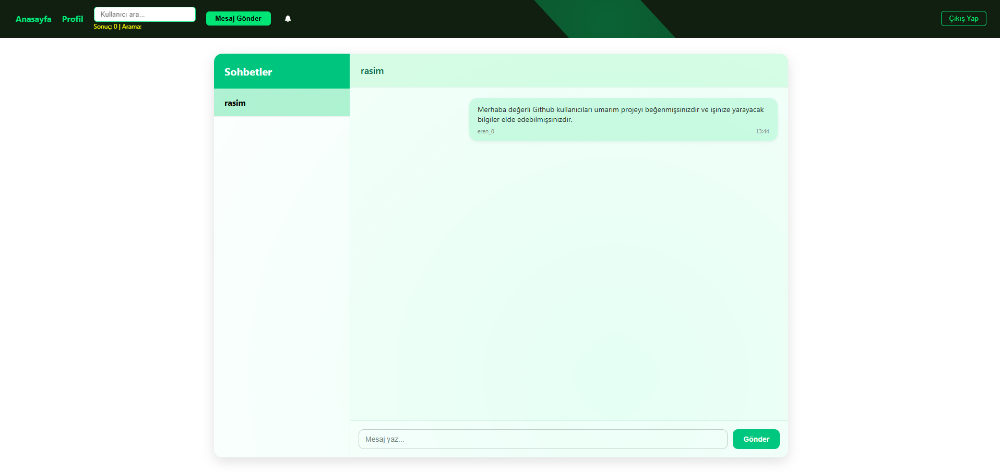
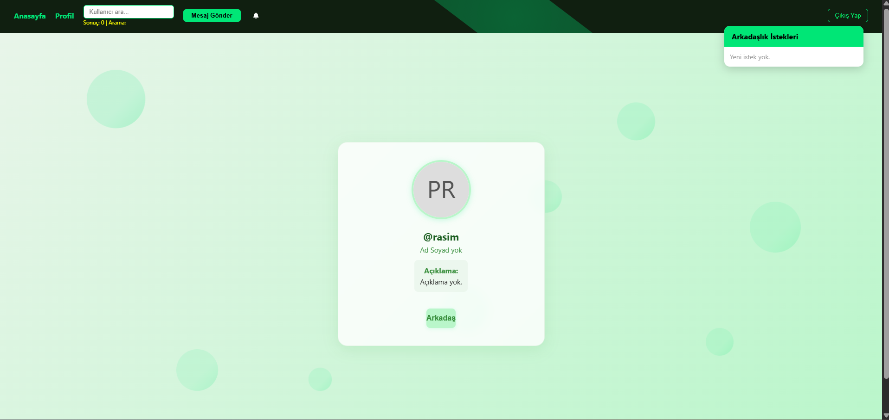

# Chatterly

## 🟢 Proje Amacı
Chatterly, modern, animasyonlu ve kullanıcı dostu bir sohbet platformudur. Kullanıcılar kolayca kayıt olabilir, arkadaş ekleyebilir, gerçek zamanlı mesajlaşabilir ve profillerini kişiselleştirebilir. Tasarımda soft yeşil ve siyah tonlar, animasyonlu geçişler ve modern UI/UX öne çıkar.

---

## 🚀 Özellikler
- **Kullanıcı Kaydı & Girişi:** E-posta/şifre veya Google ile hızlı kayıt ve giriş.
- **Profil Yönetimi:** Profil fotoğrafı, kullanıcı adı, açıklama ve diğer bilgileri güncelleme.
- **Arkadaşlık Sistemi:** Arkadaş ekleme, istek gönderme, kabul/ret işlemleri.
- **Gerçek Zamanlı Mesajlaşma:** Arkadaşlarla birebir sohbet, mesaj geçmişi.
- **Şifre Sıfırlama:** E-posta ile şifre sıfırlama desteği.
- **Kullanıcı Arama:** Navbar üzerinden kullanıcı arama ve profiline gitme.
- **Modern & Duyarlı Tasarım:** Soft yeşil ve siyah tonlarda, animasyonlu ve modern arayüz.
- **Animasyonlu Arka Planlar:** Giriş/kayıt ve profil sayfalarında hareketli, soft ışık efektleri.

---

## 🖼️ Ekran Görüntüleri
Aşağıda uygulamanın bazı ekran görüntülerini görebilirsiniz:

| Giriş/Kayıt | Ana Sayfa | Sohbet | Profil |
|-------------|-----------|--------|--------|
|  |  |  |  |

---

## 🛠️ Kullanılan Teknolojiler
- **Frontend:** React, CSS (custom), React Router
- **Backend:** Node.js, Express
- **Veritabanı:** Firebase Firestore
- **Gerçek Zamanlı:** Socket.io
- **Kimlik Doğrulama:** Firebase Auth
- **Depolama:** Firebase Storage (profil fotoğrafları için)

---

## ⚡ Kurulum

### 1. Projeyi Klonlayın
```bash
git clone https://github.com/kullaniciadi/chatterly.git
cd chatterly
```

### 2. Backend Kurulumu
```bash
cd chatterly-backend
npm install
npm start
```

### 3. Frontend Kurulumu
```bash
cd chatterly-frontend
npm install
npm start
```

### 4. Firebase Ayarları
- `chatterly-frontend/src/firebase/firebase.js` dosyasındaki Firebase yapılandırmasını kendi projenize göre doldurun.
- Firestore'da `users` koleksiyonu ve gerekli güvenlik kurallarını oluşturun.

---

## 👨‍💻 Kullanım
- Uygulama açıldığında kayıt olabilir veya giriş yapabilirsiniz.
- Navbar üzerinden kullanıcı arayabilir, arkadaş ekleyebilir ve sohbet başlatabilirsiniz.
- Profil sayfanızdan bilgilerinizi güncelleyebilirsiniz.
- Şifrenizi unuttuysanız "Şifremi Unuttum" bağlantısını kullanabilirsiniz.

---


## 📄 Lisans
MIT Lisansı
